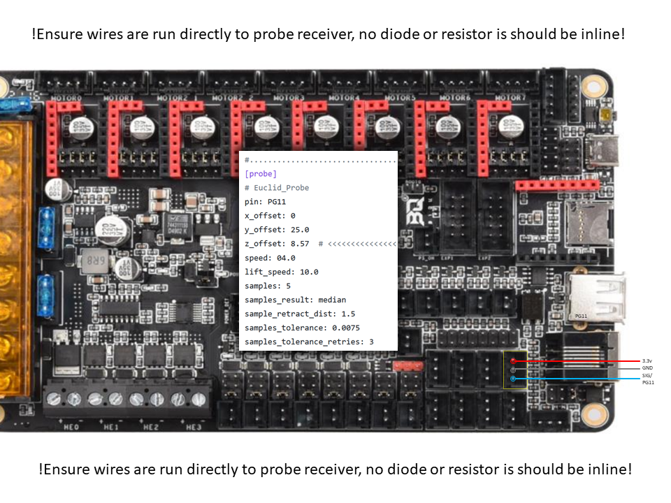

**NOTES & INFORMATION**
=================================================================================================================

This Klipper configuration will pull all files from the ACTIVE directory that end in .*cfg*, ignoring any files in the INACTIVE directory. Since I am using Samba networking file share, I can quickly move files back and forth and edit, just as they were in a folder on my desktop. If you cannot install Samba or access a network share as such, renaming any file's extension within the ACTIVE directory will prevent it from being pulled in Klipper. For example, [do_stuff.cfg] will be pulled into Klipper, while [do_stuff.cfgno] will not. Information on how to set up Samba network sharing is below.  

The [printer.cfg] in the root directory loads all the files ending with [.cfg] extension from the ACTIVE directory; the INACTIVE directory is merely a container to place the files that you may not want to be run at this particular time, such as [ARDU_ADXL.cfg]. [printer.cfg] & [FILAMENTS/ABS04.cfg] contain all global variables needed and/or shared by the macros; settings or variables that change based on the loaded filament are contained within that filament's file (in this example [FILAMENTS/ABS04.cfg]), where as non-filament specific items remain in the [printer.cfg] file. Additionally, any saved parameters written by Klipper will be at the bottom of [printer.cfg].  

Lastly, all the printer-specific configurations should be placed in a file such as [CONFIG-VORON24_350.cfg]; these are the Klipper configurations specific to your core printer. The contents can be further split if you wish; remember that the [printer.cfg] will load all files from the ACTIVE directory, regardless of name, just so long as they end with the [.cfg] extension. Make them something that makes sense to you and may be easily portable for an easy future.  

<br>

**PRINT_START** will home and the level the gantry, perform a heat soak, then G3201*, and lastly bring the hotend to temperature and execute a purge line from the front left across X-axis to check/verify easily. The purge line extrusion rate will be calculated by using the [nozzle_diameter] value.  
*The G3201 command does similar to G32 but adds a few more functions. After completing the quad gantry leveling, the macro will perform a center probe of the bed to determine the most accurate z-offset and then handles mesh application per defined settings.*

 

**PRINT_END** will raise by 10mm when the print has completed, then performs a cooling period by turning the fan fully on and then parks the toolhead at the top, front-right position. The parked Z position will be at least [ParkHeightPercentage] of the max axis height or at the printed object's Z height + 10 - whichever is taller. I reccomend setting [ParkHeightPercentage] to 0.5 - this allows for easy visual inspection of the toolhead/nozzle (and a reminder to do so) and removal of any debris. Additionally to note, PRINT_END will place the toolhead back at Y20 to allow room for the fan(s) to pull air without being blocked by being pressed up against the doors. 

**NOTE:** These configurations utilize the Euclid probe. There are two slightly different variants, each with its own flavor. The Bed Mounted (BM) docking is mounted on the bottom rail opposite the Z-Endstop, utilizing the Z-axis endstop switch for homing. The Gantry Mounted (GM) docking, where the dock is mounted on the gantry by the stepper motor, no longer requires the Z-axis endstop switch, as it uses the Euclid probe to find Z home. I have decided to switch and stay with Gantry mount as it provides a better solution for my needs and will update this set (GM) as expected. I will update the (BM) set, which is located in the INACTIVE directory, with any critical fixes, but they are very stable and offer a solid experience as is. In either case, for fetching and docking the probe, use M401 and M402 as they have safety checks to prevent crashes!  
	
<br>  
	
**EUCLID Probe notes**  
=================================================================================================================


For this configuration, the following STL files were used:  
https://github.com/nionio6915/Euclid_Probe/blob/main/stls/Voron/EuclidGantryMountyRev2.stl  
https://github.com/nionio6915/Euclid_Probe/blob/main/stls/Mount%20Adapters/Omron/OmronFotekM2_V3.stl  
<BR>

**NOTE:** If copying the Euclid macro into your existing setup, check the following:  
Do include QUERY_PROBE in your startup macro. If you do not have one, follows is a simple example you can use.  
```   
[delayed_gcode prerun]  
initial_duration: 1  
gcode:  
    QUERY_PROBE  
    M117 Printer online.  
```  
Ensure [stepper_z] has endstop_pin defined as follows:  
`endstop_pin: probe:z_virtual_endstop`  
	
<br>  
	
**! ! ! Before wiring up to the the probe, please read the pertinent documentation here: http://euclidprobe.github.io/ ! ! !**  
**! ! ! Following probe wiring or macro modification, you must be ready to emergency stop the printer when testing ! ! !**  
*When testing the probe, have at least 100mm space between probe and plate, use your finger to depress probe switch, if it doesn't*  
*stop, hit emergency stop and verify setup.*  
<br>  
	  
The method in which I wired the Euclid to my Octopus controller follows:  


**Links:**  
My Github (This file)                     https://github.com/rkolbi/voron2.4/tree/main/MY_V24-350  
RepRap G-code Wiki                        https://reprap.org/wiki/G-code  
Klipper Documentation (Main):             https://www.klipper3d.org/Overview.html    
Klipper Configuration Reference:          https://www.klipper3d.org/Config_Reference.html    
Klipper G-Code & Additional Commands:     https://www.klipper3d.org/G-Codes.html    
Klipper Github:                           https://github.com/Klipper3d    
Klipper Reddit:                           https://www.reddit.com/r/klippers/    
Jinja2 Syntax & Semantics:                https://jinja.palletsprojects.com/en/2.10.x/templates/    
Voron Documentation:                      https://docs.vorondesign.com/build/    
Voron Github:                             https://github.com/VoronDesign    
Voron Reddit:                             https://www.reddit.com/r/VORONDesign/    
Euclid Probe:                             https://euclidprobe.github.io/    
Bondtech LGX:                             https://www.bondtech.se/product/lgx-large-gears-extruder/    
Bontech CHT Nozzle:                       https://www.bondtech.se/product/bondtech-cht-coated-brass-nozzle/    
MandalaRoseWorks Kinematic Mounts:        https://mandalaroseworks.com/products/matched-height-kinematic-kit   
MandalaRoseWorks Ultraflat Mag Bed:       https://mandalaroseworks.com/products/voron-350-ultraflat-bed	


<br><br>

**SAMBA Setup - GCODE File Network Share Setup**
=================================================================================================================

To set up a network file share, making your gcode and Klipper config files available to all your network-attached devices - either windows or mac file explorers, perform the following once ssh'd into your Klipper rPi. Note that this samba configuration is 'open' and therefore accessible to any device attached to the same LAN, just as the Mainsail HTTP interface is. While it is possible to restrict access to these samba file shares, I feel it is a moot point given the nature of the rest of the software suite, so I will not cover that here. If this is worrisome to you, please research alternate configurations. 

 -Install file serving smb service:  
$`sudo apt-get install samba winbind -y`  

 -Configure file share.  Add the following to the end of the smb.conf file:  
$`sudo nano /etc/samba/smb.conf`  
	
```
[voron]  
   comment = Vonon_gCode_files  
   path = /home/pi/gcode_files  
   browseable = Yes  
   writeable = Yes  
   only guest = no  
   create mask = 0777  
   directory mask = 0777  
   public = yes  
   read only = no  
   force user = root  
   force group = root  

[voron-klipper_config]  
   comment = Vonon_Klipper  
   path = /home/pi/klipper_config  
   browseable = Yes  
   writeable = Yes  
   only guest = no  
   create mask = 0777  
   directory mask = 0777  
   public = yes  
   read only = no  
   force user = root  
   force group = root  
```


 -Reboot rPi:  
$`sudo reboot`  
	
<br>  
	
**ADXL345 (via Arduino) Resonance Testing Setup**
=================================================================================================================


This quickly outlines the setup and configuration to allow Resonance Testing, using an ADXL345 wired to an Arduino UNO, connected to klipper (in my case a raspberrypi) via USB cable.

Pertinent links:   
 rPi software setup:  
   `https://www.klipper3d.org/Measuring_Resonances.html`  
 Arduino software setup:   
   `https://www.klipper3d.org/Installation.html#building-and-flashing-the-micro-controller`  

  

 -Wire the Arduino / ADXL345 as follows:  
```	
 ADXL345      ARDUINO
   CS ------- 10/PB2
   SD0 ------ 12/PB4
   SDA ------ 11/PB3
   SCL ------ 13/PB5
```

-Shutdown rPi and power off printer. Connect Arduino to rPi via USB cable, physically attach the ADXL345 to toolhead.  
-Power-on printer, ssh into klipper systerm, and run $`ls /dev/serial/by-id/*` to detect name of serial device.  
-Make needed change to the [mcu ardu] device, adjust `probe_points: X,Y,Z` to match X & Y center of your printer, and restart printer.  
-Open terminal, run CURRENT_HIGH, then G32, close doors, use masking tape if needed.  
-Bring bed up to printing temp (110) and nozzle to 150.  
-Once bed has reached temp, heat soak for ~20 minutes.  
-Perform `SHAPER_CALIBRATE`, and when done, `SAVE_CONFIG` to save found settings.  

```
[mcu ardu]
   serial: /dev/serial/by-id/usb-Silicon_Labs_CP2104_USB_to_UART_Bridge_Controller_0199928E-if00-port0
   # Be sure to change serial address below as per output of 'ls /dev/serial/by-id/*'

[adxl345]
   cs_pin: ardu:PB2
 
[resonance_tester]
   accel_chip: adxl345
   probe_points: 175,175,20
```
