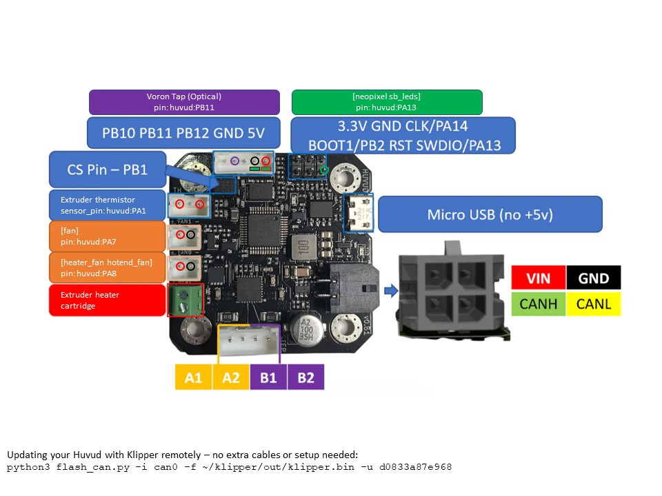

**TAP, SENSORLESS HOMING, HUVUD w/WAVESHARE HAT**  
=================================================================================================================

This Klipper configuration will pull all files from the ACTIVE directory that end in .*cfg*, ignoring any files in the INACTIVE directory. Since I am using Samba networking file share, I can quickly move files back and forth and edit, just as they were in a folder on my desktop. If you cannot install Samba or access a network share as such, renaming any file's extension within the ACTIVE directory will prevent it from being pulled in Klipper. For example, [do_stuff.cfg] will be pulled into Klipper, while [do_stuff.cfgno] will not. Information on how to set up Samba network sharing is below.  

The [printer.cfg] in the root directory loads all the files ending with [.cfg] extension from the ACTIVE directory; the INACTIVE directory is merely a container to place the files that you may not want to be run at this particular time, such as [ARDU_ADXL.cfg]. [printer.cfg] contains all global variables needed and/or shared by the macros. Additionally, any saved parameters written by Klipper will be at the bottom of [printer.cfg].  

Lastly, all the printer-specific configurations should be placed in a file such as [CONFIG-VORON24_350.cfg]; these are the Klipper configurations specific to your core printer. The contents can be further split if you wish; remember that the [printer.cfg] will load all files from the ACTIVE directory, regardless of name, just so long as they end with the [.cfg] extension. Make them something that makes sense to you and may be easily portable for an easy future.  

<br>

**PRINT_START** will home and the level the gantry, perform a heatsoak*, then G3201 with Adaptive Mesh*, and lastly bring the hotend to temperature and execute a purge line from the front left across X-axis to check/verify easily. The purge line extrusion rate will be calculated by using the [nozzle_diameter] value. *The heatsoak cycle can be terminated early by either selecting RUSUME or by executing the WAIT_QUIT macro. The G3201 command does similar to G32 but adds a few more functions. After completing the quad gantry leveling, the macro will perform a center probe of the bed to determine the most accurate z-offset and then runs adaptive mesh application.*

-SuperSlicer's start print gcode should contain the following:  

  ```
PRINT_START BED_TEMP=[first_layer_bed_temperature] EXTRUDER_TEMP=[first_layer_temperature] PA=0.045 ST=0.21 SIZE={first_layer_print_min[0]}_{first_layer_print_min[1]}_{first_layer_print_max[0]}_{first_layer_print_max[1]}
  ```
  See `https://github.com/Frix-x/klipper-voron-V2/blob/main/macros/probing/bed_mesh.cfg`  

-The following optional parameters can be specified. If not specified, the values set in printer.cfg will be used.  
   -PA, pressure advance, as `PA=0.045`  
   -ST, pressure advance smooth-time, as `ST=0.21`  
   -SOAK, minutes to heat-soak prior to final G32, meshing, and printing, as `SOAK=15`  

**PRINT_END** will raise by 10mm when the print has completed, then performs a cooling period by turning the fan fully on and then parks the toolhead at the top, front-right position. The parked Z position will be at least [ParkHeightPercentage] of the max axis height or at the printed object's Z height + 10 - whichever is taller. I reccomend setting [ParkHeightPercentage] to 0.5 - this allows for easy visual inspection of the toolhead/nozzle (and a reminder to do so) and removal of any debris. Additionally to note, PRINT_END will place the toolhead back at Y20 to allow room for the fan(s) to pull air without being blocked by being pressed up against the doors. 

-SuperSlicer's end print gcode should contain the following:  
  `PRINT_END`    


:bulb: These configs use Klipper LED Effects plugin located here: https://github.com/julianschill/klipper-led_effect  
:bulb: Sensorless homing based off Clee's work, found [here](https://docs.vorondesign.com/community/howto/clee/sensorless_xy_homing.html) - Klipper documentation [here](https://www.klipper3d.org/TMC_Drivers.html#sensorless-homing).

<br>  
<br>  

**HUVUD Setup**
=================================================================================================================

TAP probe (optical) with Huvud toolhead controller wiring diagram follows. Detailed information on CAN [here](CAN-Application.pdf).




​          

**Solving Excessive CAN0 RX Errors, running rPi4 64bit, klipper latest 64bit**  
*-Linux 5.15.84-v8+ #1613 SMP PREEMPT Thu Jan 5 12:03:08 GMT 2023 aarch64 GNU/Linux*  
*-WaveShare RS485 CAN HAT for Raspberry Pi - 12M crystal*  

I got many daily RX errors (`ip -details -statistics link show can0`). While not showing any errors in Klipper, I suffered a communication timeout error twice over the past few days. Through some internet diving, SPI speeds with 64bit OS are an issue, suggesting they are about halved and change based on the core speed of the rPi. I think this situation was made worse by WaveShare's documentation to set `spimaxfrequency=2000000`. As of now, I have been RX error free by using the following. Please research these changes before implementing them, as I am no rPi expert - just letting you know what worked for me.  

To get the WaveShare canhat working properly, I set these in ` /boot/config.txt`  
```
dtparam=spi=on  
dtoverlay=mcp2515-can0,oscillator=12000000,interrupt=25  
dtoverlay=spi0-hw-cs  
```

And also set `/etc/network/interfaces.d/can0` as:  
```
auto can0  
iface can0 can static  
 bitrate 1000000  
 up ifconfig $IFACE txqueuelen 128  
 pre-up ip link set can0 type can bitrate 1000000  
 pre-up ip link set can0 txqueuelen 128  
```

<br>

<br>

May be releated to WaveShare success - not sure, I lock my speed to 1200000 by adding the following to `/boot/config.txt`  
```
arm_freq=1200  
core_freq=500  
core_freq_min=500  
```

And made the following changes to `/etc/rc.local`  
```
_IP=$(hostname -I) || true  
if [ "$_IP" ]; then  
  printf "My IP address is %s\n" "$_IP"  
fi  
iwconfig wlan0 power off  
echo "performance" | sudo tee /sys/devices/system/cpu/cpufreq/policy0/scaling_governor  
exit 0  
```

<br>

**SAMBA Setup - GCODE File Network Share Setup**
=================================================================================================================

To set up a network file share, making your gcode and Klipper config files available to all your network-attached devices - either windows or mac file explorers, perform the following once ssh'd into your Klipper rPi. Note that this samba configuration is 'open' and therefore accessible to any device attached to the same LAN, just as the Mainsail HTTP interface is. While it is possible to restrict access to these samba file shares, I feel it is a moot point given the nature of the rest of the software suite, so I will not cover that here. If this is worrisome to you, please research alternate configurations. 

 -Install file serving smb service:  
$`sudo apt-get install samba winbind -y`  

 -Configure file share.  Add the following to the end of the smb.conf file:  
$`sudo nano /etc/samba/smb.conf`  
	
```
[voron]  
   comment = Voron_gCode_files  
   path = /home/pi/gcode_files  
   browseable = Yes  
   writeable = Yes  
   only guest = no  
   create mask = 0777  
   directory mask = 0777  
   public = yes  
   read only = no  
   force user = root  
   force group = root  

[voron-klipper_config]  
   comment = Voron_Klipper  
   path = /home/pi/klipper_config  
   browseable = Yes  
   writeable = Yes  
   only guest = no  
   create mask = 0777  
   directory mask = 0777  
   public = yes  
   read only = no  
   force user = root  
   force group = root  
   
[Klipper_Storage]
   comment = Voron_Storage
   path = /home/pi/Storage
   browseable = Yes
   writeable = Yes
   only guest = no
   create mask = 0777
   directory mask = 0777
   public = yes
   read only = no
   force user = root
   force group = root  
```


 -Reboot rPi:  
$`sudo reboot`  
	

In the event that windows shows a red-x through the mapped share, I have found the following helpful in restoring mapped network shares:  
- Run `CMD` as administrator  
- `net stop workstation /y`  
- `net start workstation`  

<br>  
	


**Links**
=================================================================================================================


My Github (This file)                     https://github.com/rkolbi/voron2.4/tree/main/MY_V24-350  
RepRap G-code Wiki                        https://reprap.org/wiki/G-code  
Klipper Documentation (Main):             https://www.klipper3d.org/Overview.html    
Klipper Configuration Reference:          https://www.klipper3d.org/Config_Reference.html    
Klipper G-Code & Additional Commands:     https://www.klipper3d.org/G-Codes.html    
Klipper Github:                           https://github.com/Klipper3d    
Klipper Reddit:                           https://www.reddit.com/r/klippers/    
Jinja2 Syntax & Semantics:                https://jinja.palletsprojects.com/en/2.10.x/templates/    
Voron Documentation:                      https://docs.vorondesign.com/build/    
Voron Github:                             https://github.com/VoronDesign    
Voron Reddit:                             https://www.reddit.com/r/VORONDesign/    
Euclid Probe:                             https://euclidprobe.github.io/    
Bondtech LGX:                             https://www.bondtech.se/product/lgx-large-gears-extruder/    
Bontech CHT Nozzle:                       https://www.bondtech.se/product/bondtech-cht-coated-brass-nozzle/    
MandalaRoseWorks Kinematic Mounts:        https://mandalaroseworks.com/products/matched-height-kinematic-kit   
MandalaRoseWorks Ultraflat Mag Bed:       https://mandalaroseworks.com/products/voron-350-ultraflat-bed	 
